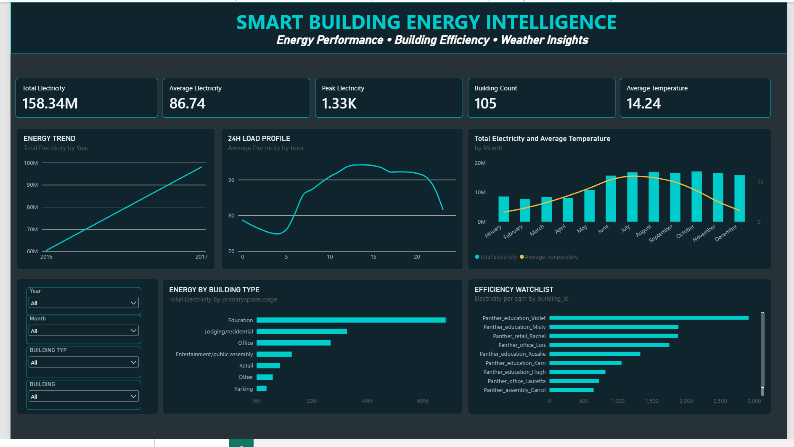
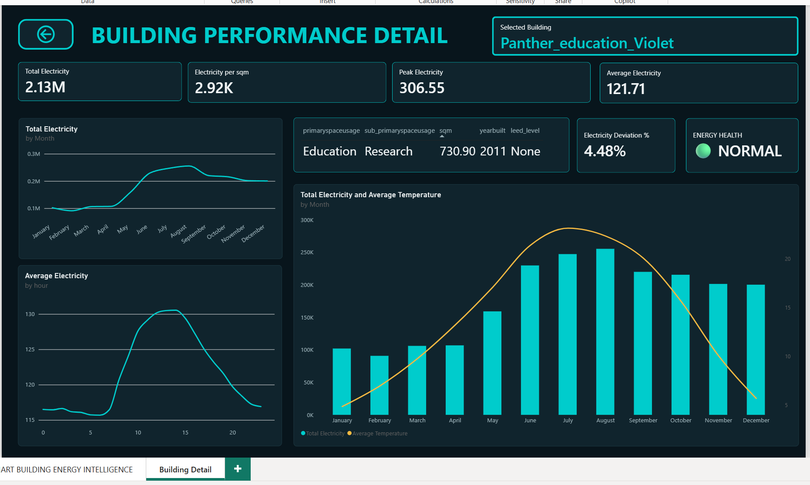

# 🏢 Smart Building Energy Intelligence

An end-to-end **Power BI Business Intelligence project** designed to analyze energy consumption across a portfolio of smart buildings.

The project transforms raw building, electricity, and weather data into an interactive decision-support dashboard for monitoring energy performance, identifying inefficient buildings, understanding consumption patterns, and investigating unusual energy behavior.

---

## 📊 Dashboard Preview

### Executive Overview



### Building Performance Detail



---

## 🎯 Business Problem

Building and energy managers need an efficient way to answer questions such as:

- Which buildings consume the most electricity?
- When does peak electricity consumption occur?
- How does energy consumption vary by building type?
- Which buildings consume the most electricity relative to their floor area?
- How does outside temperature relate to energy demand?
- What is the typical 24-hour load profile of a building?
- Which buildings show unusual consumption behavior?
- How can users move from a portfolio overview to an individual building investigation?

The objective was therefore to create an interactive BI solution that transforms raw smart-building data into actionable information.

---

## 🛠️ Tech Stack

- **Power BI**
- **Power Query**
- **DAX**
- **Dimensional Data Modeling**
- **ETL**
- **Data Profiling & Data Quality**
- **Interactive Data Visualization**

---

# 🔄 Data & ETL Process

The project uses three main types of source data:

### Building Metadata

Contains descriptive information about each building, including:

- Building ID
- Site
- Building usage
- Floor area
- Construction year
- Electricity availability
- Chilled-water availability
- Energy-related metadata

### Electricity Data

Contains hourly electricity measurements across a large portfolio of buildings.

The original structure was wide:

```text
timestamp | Building_A | Building_B | Building_C | ...
```

For analytical purposes, it was transformed into:

```text
timestamp | building_id | electricity_consumption
```

### Weather Data

Contains weather observations including:

- Air temperature
- Dew temperature
- Precipitation

Weather data provides additional context when analyzing changes in building electricity demand.

---

# 🧹 Data Preparation

Power Query was used to:

- Profile the source data
- Identify missing values
- Validate data types
- Filter the relevant site and buildings
- Remove unnecessary columns
- Select buildings with electricity measurements
- Reshape electricity data using **Unpivot**
- Create Date and Hour fields
- Prepare building and weather tables
- Optimize the ETL pipeline before loading data into the model

An important data-quality principle used throughout the project was:

> **A missing value is not automatically equal to zero.**

For example, a zero electricity reading and a missing electricity reading can represent two different situations and should not automatically be treated the same way.

---

# ⚡ ETL Performance Optimization

One of the most important technical challenges in the project was processing the electricity dataset efficiently.

## Initial approach

The first ETL implementation performed the **Unpivot operation before reducing the building scope**.

This created approximately:

**26.8 million intermediate rows**

and significantly increased processing time.

Initial pipeline:

```text
Large electricity dataset
        ↓
Unpivot all building columns
        ↓
~26.8M intermediate rows
        ↓
Filter relevant buildings
        ↓
Analytical dataset
```

## Optimized approach

The pipeline was redesigned so that the relevant building columns were selected **before** the expensive Unpivot operation.

A dynamic list of building IDs was created from the building dimension and used to select only the required electricity columns.

```text
Large electricity dataset
        ↓
Select relevant buildings
        ↓
Reduce columns
        ↓
Unpivot selected buildings only
        ↓
Analytical fact table
```

This reduced unnecessary processing and improved refresh performance.

### Key Learning

> **ETL performance depends not only on which transformations are performed, but also on the order in which they are executed.**

---

# 🗂️ Data Model

The Power BI model uses a dimensional structure with fact and dimension tables.

```text
              Dim_Building
                    1
                    │
                    *
            Fact_electricity
                    *
                    │
                    1
                Dim_Date
                    1
                    │
                    *
              Fact_weather
```

## Dim_Building

Contains descriptive building attributes used for filtering and segmentation.

Examples:

- Building ID
- Building type
- Floor area
- Construction year
- LEED level

## Dim_Date

Provides the calendar structure used throughout the report.

Includes:

- Date
- Year
- Quarter
- Month
- Month Number
- Day of Week

## Fact_electricity

Contains electricity measurements at building/time level.

Key fields:

```text
timestamp
building_id
electricity_consumption
date
hour
```

## Fact_weather

Contains weather observations used to provide environmental context.

---

# 📐 Key DAX Measures

The report includes several reusable DAX measures.

### Total Electricity

```DAX
Total Electricity =
SUM(Fact_electricity[electricity_consumption])
```

### Average Electricity

```DAX
Average Electricity =
AVERAGE(Fact_electricity[electricity_consumption])
```

### Peak Electricity

```DAX
Peak Electricity =
MAX(Fact_electricity[electricity_consumption])
```

### Building Count

```DAX
Building Count =
DISTINCTCOUNT(Dim_Building[building_id])
```

### Average Temperature

```DAX
Average Temperature =
AVERAGE(Fact_weather[airTemperature])
```

### Electricity per sqm

```DAX
Electricity per sqm =
DIVIDE(
    [Total Electricity],
    SUM(Dim_Building[sqm])
)
```

Electricity per square meter helps compare buildings more fairly because total electricity consumption alone can be misleading when buildings have very different floor areas.

---

# 📊 Executive Overview

The main dashboard provides a portfolio-level view of building energy performance.

### Interactive Filters

Users can filter the report by:

- Year
- Month
- Building Type
- Individual Building

### KPI Cards

The overview contains:

- Total Electricity
- Average Electricity
- Peak Electricity
- Building Count
- Average Temperature

### Analytical Visuals

The dashboard includes:

#### Energy Trend

Shows how electricity consumption changes over time.

#### 24H Load Profile

Shows average electricity behavior across the 24 hours of the day.

This can help identify:

- Daytime peaks
- Overnight consumption
- Operational patterns
- Potentially unusual usage outside normal hours

#### Energy by Building Type

Compares electricity consumption across different categories of buildings.

#### Energy × Weather

Compares electricity behavior with outside temperature to provide environmental context.

#### Efficiency Watchlist

Ranks buildings using electricity consumption normalized by floor area.

This helps avoid automatically classifying large buildings as inefficient simply because they consume more total electricity.

---

# 🔎 Building Performance Detail

The report includes an interactive **drill-through page** for individual building investigation.

A user can start from the portfolio overview and open the detailed analysis for a selected building.

The page includes:

- Selected building
- Total Electricity
- Average Electricity
- Peak Electricity
- Electricity per sqm
- Building characteristics
- Monthly Energy Profile
- 24H Load Profile
- Energy × Weather
- Energy Health
- Deviation from Baseline

This allows the analysis to move from:

```text
Portfolio
    ↓
Building Type
    ↓
Specific Building
    ↓
Detailed Investigation
```

---

# 🚨 Energy Health Monitoring

The project includes a **baseline-based anomaly monitoring feature**.

The objective is to compare observed electricity consumption with the building's expected historical behavior.

The process is:

```text
Historical behavior
        ↓
Expected electricity baseline
        ↓
Compare with actual consumption
        ↓
Calculate deviation
        ↓
Energy Health classification
```

The prototype classifies the result as:

- 🟢 **NORMAL**
- 🟠 **WARNING**
- 🔴 **ANOMALY**

The thresholds are demonstration rules designed for the prototype.

> **Important:** This feature is baseline/rule-based analytical monitoring. It is not presented as a trained machine-learning model.

A future version could use machine learning with variables such as temperature, hour, building characteristics, and historical consumption.

---

# 💡 Key Technical Learnings

This project strengthened my understanding of:

### ETL

Reducing unnecessary data early in the pipeline can significantly improve performance.

### Data Quality

Missing values must be interpreted according to their business meaning rather than automatically replaced.

### Data Modeling

Separating dimensions from fact tables creates a cleaner and more maintainable analytical model.

### DAX

Measures provide dynamic calculations that respond to report filter context.

### Performance Optimization

Transformation order can have a major impact on refresh performance.

### Business Intelligence

A dashboard should not simply display data.

It should help users answer business questions and move from:

```text
Data
 ↓
Information
 ↓
Insight
 ↓
Investigation
 ↓
Decision
```

---

# 🚀 Future Improvements

Possible future developments include:

- Machine-learning-based anomaly detection
- Predictive electricity consumption
- Real-time IoT data integration
- Automated alerts
- Additional building-comfort indicators
- Live cloud data pipelines
- More advanced performance monitoring

---

# 📁 Repository Structure

```text
smart-building-energy-intelligence/
│
├── README.md
│
├── Smart_Building_Energy_Intelligence.pbix
│
├── executive-overview.png
│
├── building-detail.png
└── Smart_Building_GitHub_Portfolio.pdf
```

The large raw datasets are not included in the repository.

---

# 📄 Project Documentation

A detailed portfolio presentation is available here:

**[Smart Building GitHub Portfolio](Smart_Building_GitHub_Portfolio.pdf)**

---

# 👤 Author

**Khalid Arakkas**

Business Intelligence & Analytics / Business Informatics

Interested in:

- Business Intelligence
- Data Analytics
- Digital Transformation
- Data Modeling
- Business Analysis

---

## ⭐ Project Summary

This project demonstrates an end-to-end Power BI workflow:

**Raw Data → Data Profiling → Power Query ETL → Performance Optimization → Dimensional Modeling → DAX → Interactive Dashboard → Drill-Through Analysis → Baseline Energy Monitoring**

The main objective was not only to create visualizations, but to build a structured analytical solution that transforms raw smart-building data into useful business insights.
